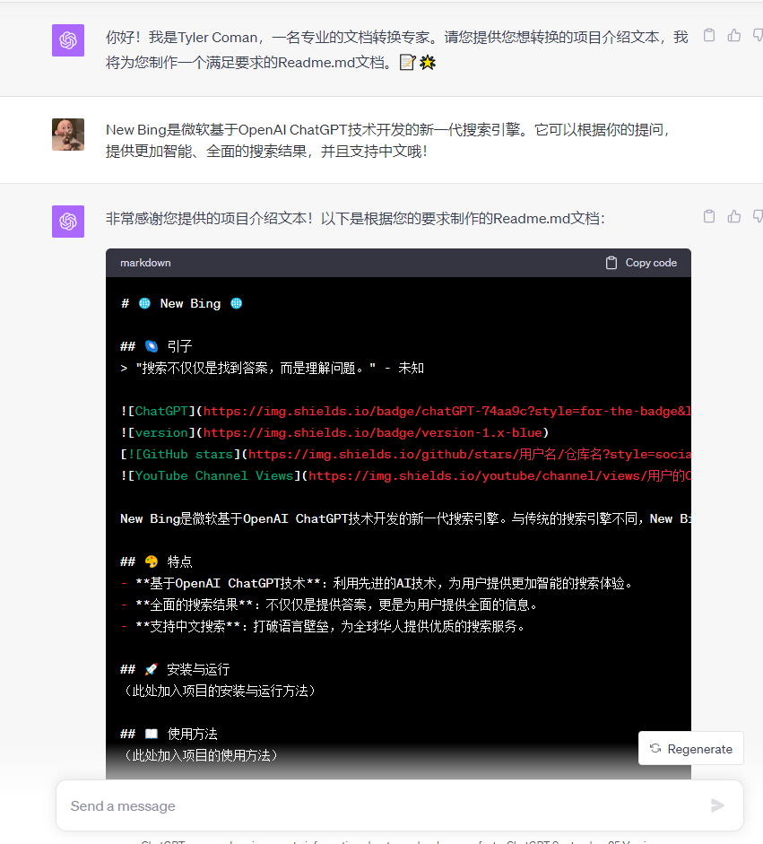

# 📄 一键生成Readme文档工具 🛠️

## 🌌 引子
> "知识就是力量，而良好的介绍文档是知识传播的关键。"

- 这个Prompt可以帮你一键生成结构化的、带有Emoji图案的Readme文档。美观、易用，使用Markdown格式，方便您上传到各个平台上去使用。
- 这个仓库的Readme文档本身就是通过这个Prompt创建的！

## 🚀 特点
- **结构化设计**：确保文档清晰、有条理。
- **Emoji图案**：使文档更加生动、吸引人。
- **Markdown格式**：兼容各大平台，方便分享和展示。

## 📥 使用方法
- 建议使用GPT-4输入Prompt，即可开始体验。[立即体验](https://chat.openai.com/share/19590fee-0ba1-42be-876b-761137d37ca8)
_________________

## 🎨 效果展示

## 🎖️个人链接
- 🙏 请关注我的YouTube频道，探索更多AI创作之秘👏：[AI Genius Minds](https://www.youtube.com/@AIGeniusMinds)
- 🙏 欢迎浏览我的FlowGPT主页，发现更多创意之源👏：[Tyler Coman](https://flowgpt.com/@tyler-coman)

## 🍁 致谢

- 感激[LangGPT](https://github.com/yzfly/LangGPT)的结构化提示词项目，为我的创作带来了无尽的启示和灵感。
- 感谢[FlowGPT](https://flowgpt.com/)，在这里我找到了许多值得分享的Prompt灵感！
